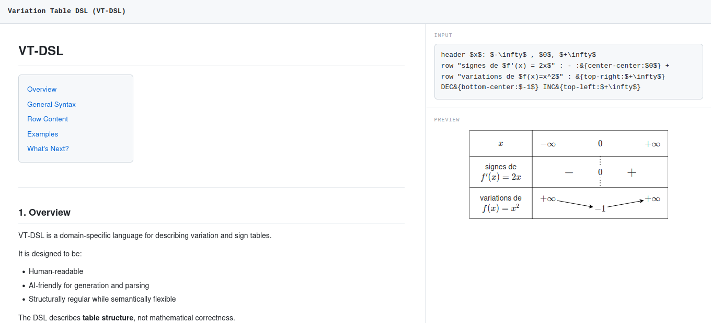

# VariationTable React Component & VT-DSL

A high-performance React component and domain-specific language (DSL) designed to revolutionize the creation and annotation of mathematical variation and sign tables.



## 🎯 Problem Statement

This project addresses the critical limitations of traditional LaTeX-based tools (like `tkz-tab`) during data annotation:

1. **Lack of Real-time Feedback**: Eliminates the "blind" annotation process and the constant switching between editor and LaTeX compilers (like Overleaf).
2. **AI Code Quality**: `tkz-tab` syntax is often too cryptic for LLMs, leading to syntax errors. **VT-DSL** is designed to be verbose, explicit, and error-tolerant, making it highly "AI-friendly" for both generation and parsing.
3. **Mathematical Flexibility**: Unlike strict LaTeX packages, this tool allows for "mathematically incorrect" or hybrid annotations (reversed arrows, custom text/variation mixes), which are essential for diverse annotation needs.

## 🚀 Key Technologies

- **React.js**: For the reactive interface and component-based architecture.
- **VT-DSL & Peggy.js**: A custom grammar and parser that converts raw text into a structured **Abstract Syntax Tree (AST)**.
- **Hybrid Rendering Engine**:
  - **KaTeX Layer**: High-quality rendering of mathematical expressions and labels.
  - **SVG Layer**: Dynamic drawing of table structures, forbidden zones, separators, and variation arrows.
- **Measurement Engine**: A sophisticated system to measure KaTeX element dimensions in real-time to ensure precise alignment of SVG arrows.

------

## 🏗️ VT-DSL Overview

The language is designed to be human-readable and easy for AI to generate from images or descriptions.

**Example Syntax:**

Plaintext

```
header : $-\infty$,$0$,$+\infty$
row "signe de $f'$": + :& -
row "variation de $f(x)$": INC DEC
```

## 📸 Demo & Features

- **Live Preview**: Instant rendering as you type.
- **Error Tolerance**: The parser is designed to handle common syntax slips without breaking the UI.
- **Hybrid Content**: Seamlessly mix LaTeX math, plain text, and complex variation arrows.

------

## 🛠️ Architecture Deep Dive

### The Rendering Challenge

One of the main technical hurdles was the **synchronization between the DOM (KaTeX) and SVG**. Since SVG arrows depend on the exact position and size of the KaTeX labels, the component implements a measurement lifecycle to calculate bounding boxes before drawing the vector layers.

### AI-First Design

The **VT-DSL** was specifically engineered to avoid the ambiguity of LaTeX. By being more explicit (using labels like `header`, `row`, `INC`, `DEC`), it significantly reduces the hallucination rate of AI models when they are asked to convert a table image into code.

------

## 🚀 How to Run the Demo

1. Clone the repository.
2. Run `npm install`.
3. Launch with `npm start` to view the interactive tutorial and playground.
